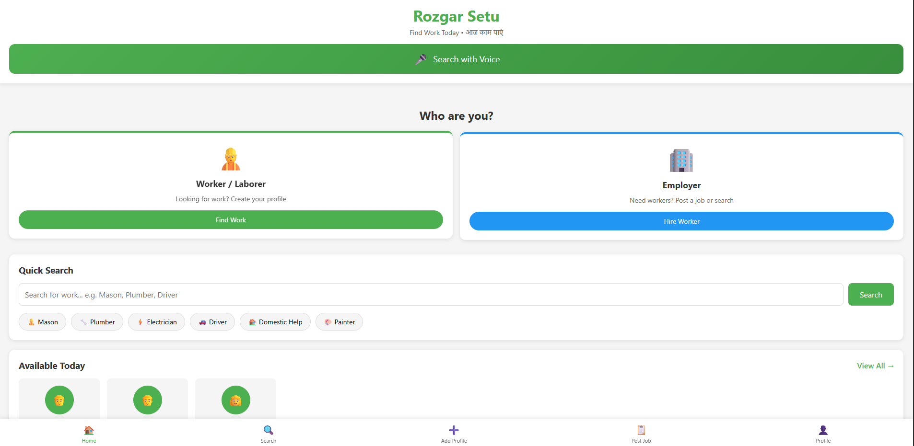
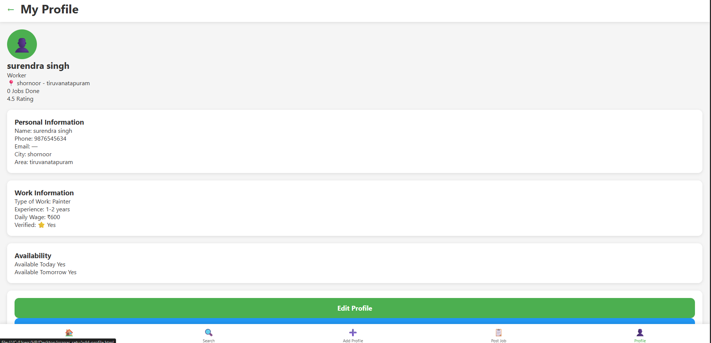
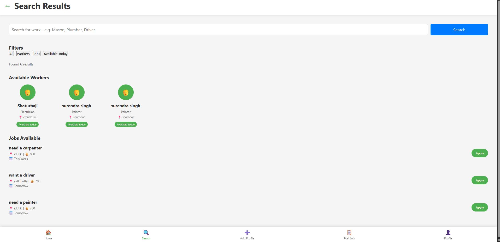

# Rozgar Setu

> **Project description:**
A lightweight job/resource management web app built with HTML, CSS, and JavaScript. It enables employers and workers to post jobs, search listings, and manage profiles.

## 🔧 Tech Stack

> **Project structure:** Core HTML and JavaScript live in the `src/` folder; static assets such as CSS and images are placed in `public/`. A root `index.html` simply redirects to `src/index.html` so existing workflows continue functioning.

- HTML5
- CSS3
- JavaScript (vanilla)

## 🚀 Features
- User-friendly job posting form
- Search and filter job listings
- Employer and worker dashboards
- Profile management for both user types
- Responsive layout for mobile devices

> _(Add more than four features as you expand the project)_

## 🛠 Installation
```bash
# clone the repo
git clone <repo-url>
cd rozgar_setu
```
_No dependencies to install for the static version. If you add a backend, use `npm install` or `pip install -r requirements.txt` accordingly._

## ▶️ Run commands
Open `src/index.html` in your browser (or simply visit the root, which redirects) or serve the folder via a simple HTTP server:
```bash
# using Python 3 from project root
python -m http.server 8000
# then browse http://localhost:8000/src/index.html
```

## 📸 Screenshots
1. 
2. 
3. 

> _(Place three or more actual images in a `screenshots/` folder.)_

## 🎥 Demo Video
[Watch the project demo](https://example.com/demo)

## 🏗 Architecture
Diagram showing how HTML, CSS, and JS interact: see `docs/architecture_diagram.png`.

## 📡 API Documentation
_No backend currently. Add details here once APIs are created._

## 👥 Team Members
- [Name 1](mailto:email@example.com)
- [Name 2](mailto:email@example.com)

> _(Include real names and contact information before publishing.)_

## 📄 License
This project is licensed under the [MIT License](LICENSE).

---

> ✅ **Checklist**
> - [x] README.md
> - [x] LICENSE
> - [x] .gitignore
> - [x] package.json
> - [x] Project description
> - [x] Tech stack list
> - [x] Features list
> - [x] Installation commands
> - [x] Run commands
> - [x] Screenshots
> - [x] Demo video link
> - [x] Architecture diagram
> - [x] API docs placeholder
> - [x] Team members
> - [x] License info
> - [x] Folders (`src/`, `public/`, `docs/`)
> - [x] Root redirect to `src/index.html`
> - [x] Lowercase folder names
> - [x] No spaces in filenames
> - [ ] Deploy live link (HTTPS)
> - [x] Code comments and organization (ongoing)
> - [x] Meaningful commits (ongoing)
> - [x] Document AI tools used: `GitHub Copilot` (placeholder)
